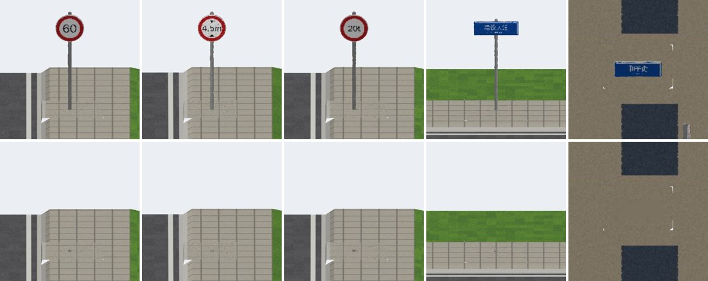
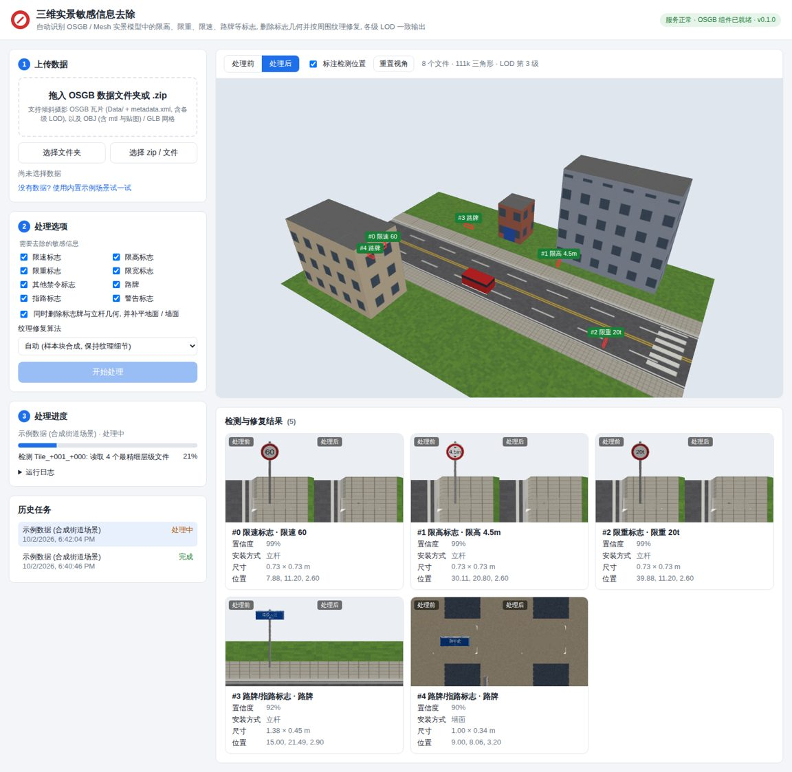

# sensitive3d：三维实景模型敏感信息自动去除

上传倾斜摄影 **OSGB**（含各级 LOD）或 **OBJ / GLB** 网格后，系统全自动完成三件事：

1. 识别模型中的限速、限高、限重、限宽等禁令标志，以及路牌、指路标志、警告标志。
2. 删除标志牌和立杆的几何，并补平地面或墙面。
3. 用周围的真实纹理修复贴图，各级 LOD 保持一致。

输出文件的目录结构、文件名和 PagedLOD 层级与输入完全相同，可以直接替换原数据使用。



*合成测试场景中的 5 个标志（限速 60、限高 4.5m、限重 20t、立杆路牌、墙面路牌），上排为处理前，下排为处理后。*



## 功能

| 功能 | 说明 |
| --- | --- |
| 输入格式 | OSGB 瓦片数据集（`Data/Tile_*/…osgb` + `metadata.xml`，含全部 LOD）、OBJ（含 mtl 和贴图）、GLB/glTF |
| 自动识别 | 在最精细一级 LOD 上识别标志，结果是带朝向的三维区域，并读出数值（如“限速 60”“限重 20t”“限高 4.5m”） |
| 几何去除 | 自动判断安装方式（立杆 / 墙面 / 悬挂），删除牌面和立杆，补平留下的孔洞，并在纹理图集中为补丁分配空间 |
| 纹理修复 | 用多尺度样本块合成（PatchMatch）从周围复制真实纹理，接缝处做颜色融合；可选接入 LaMa 深度修复模型 |
| 多级 LOD | 修复只做一次，所有 LOD 从同一份修复结果采样，远近切换时看起来一致 |
| 隐私保证 | 被删除面片在纹理图集里原先占用的区域、图集边缘的填充像素也会被覆盖，文件里不会残留标志内容；处理完成后会重新检测一遍 |
| 保真输出 | 没有修改的纹理按原始 JPEG 字节写回，不会二次压缩；没有修改的文件直接复制 |
| 网页界面 | 支持拖入文件夹或 zip，可查看处理进度、三维前后对比、每个标志的前后缩略图，并下载结果 |

## 快速开始

### 方式一：Docker（推荐用于部署）

```bash
docker build -t sensitive3d .
docker run -p 8000:8000 -v $PWD/workspace:/data/workspace sensitive3d
# 浏览器打开 http://localhost:8000
```

### 方式二：本地安装（Ubuntu / Debian）

```bash
sudo apt install openscenegraph libopenscenegraph-dev cmake g++ fonts-wqy-zenhei
./scripts/build_bridge.sh          # 编译 OSGB 读写组件 native/osgb_bridge
pip install -e .                   # Python ≥ 3.9
sensitive3d serve --port 8000      # 浏览器打开 http://127.0.0.1:8000
```

**Windows**：先用 vcpkg 安装 OpenSceneGraph（`vcpkg install osg:x64-windows`），再编译组件：

```
cmake -S native/osgb_bridge -B native/osgb_bridge/build -DCMAKE_TOOLCHAIN_FILE=<vcpkg>/scripts/buildsystems/vcpkg.cmake
cmake --build native/osgb_bridge/build --config Release
```

如果组件不在默认位置，用环境变量 `S3D_OSGB_BRIDGE` 指定它的路径。

> 只处理 OBJ / GLB 时不需要编译 OSGB 组件。

### 没有数据？先用示例场景试一试

点击网页上的“使用内置示例场景”，或用命令行生成测试数据：

```bash
sensitive3d synth data/synthetic          # 生成 OSGB（4 级 LOD）、OBJ、GLB 三种格式
sensitive3d process data/synthetic/osgb data/out
```

## 使用方法

### 网页

1. **上传数据**：拖入 OSGB 数据集文件夹（即包含 `Data/` 和 `metadata.xml` 的那一层），或拖入 zip / OBJ / GLB。
2. **选择选项**：选择要去除的标志类别、是否同时删除几何，以及纹理修复算法。
3. **开始处理**：完成后可以在三维视图里切换“处理前 / 处理后”。点击结果卡片会自动定位到对应标志。
4. **下载结果**：zip 包内是修复后的完整数据集，另附 `sensitive3d_report.json` 处理报告。

### 命令行

```bash
# 全自动检测并去除
sensitive3d process <输入目录或文件> <输出目录> [选项]
  --categories speed_limit,height_limit,weight_limit,road_name   # 只去除指定类别（默认全部）
  --texture-only          # 不改几何，只修复纹理
  --inpaint auto|telea|lama  [--lama big-lama.onnx]
  --yolo signs.onnx       # 可选：接入训练好的 YOLO 交通标志模型
  --regions regions.json  # 跳过自动检测，按给定区域去除

# 只检测，输出区域列表
sensitive3d detect <输入> --json regions.json
```

报告和预览图写在 `<输出目录>_s3d/` 下，可用 `--report-dir` 修改。

类别名称：`speed_limit` 限速、`height_limit` 限高、`weight_limit` 限重、`width_limit` 限宽、`prohibitory` 其他禁令、`road_name` 路牌、`guide` 指路、`warning` 警告。

## 处理流程

```
扫描数据集 ──► 自动检测（最精细 LOD）──► 几何去除 + 补洞 ──► 修复视图 + 纹理补全 ──► 所有 LOD 采样写回 ──► 复检 + 报告
```

1. **扫描**：`osgb_bridge info` 只解析结构、不解码贴图，快速得到每个文件的包围盒、LOD 关系和最精细层级。
2. **候选**：在最精细层级的贴图中找出标志常用颜色（红、蓝、绿、黄）的像素，反算到三维后聚类，得到候选区域。
3. **验证与定位**：对每个候选区域正对着渲染一张特写，用形状加内容判断类别（红圈加白底黑字、蓝或绿矩形加白字、黄三角），并通过模板匹配读出数值；然后把 2D 掩膜反投影成三维平面区域。
4. **几何去除**：判断安装方式。立杆标志删除牌面和地面以上的立杆；墙面标志只删除牌面。留下的孔洞用平面补丁封闭，补丁的贴图空间优先使用被删面片释放出的图集区域。
5. **纹理修复**：从正对牌面的视角、以及立杆底部的俯视角各渲染一张修复图，补全缺失内容后写回每一级 LOD 的对应纹理像素。较粗的 LOD 只删除完全落在标志范围内的面，并加大重绘范围。
6. **写回**：只修改改动过的几何和纹理，其余部分（PagedLOD、文件名、渲染状态、未改动的 JPEG）原样保留。

详细说明见 [docs/技术方案.md](docs/技术方案.md)。

## 项目结构

```
native/osgb_bridge/      C++ OSGB 读写组件（OpenSceneGraph）：info / export / patch / build
sensitive3d/
  core/                  网格模型、numba 光栅化、正交相机与渲染、纹理采样
  io/                    OSGB / OBJ / glTF 读写与数据集扫描
  detect/                候选生成、无模型检测器、可选 YOLO ONNX、三维区域
  repair/                几何去除与补洞、图像补全、修复视图与多 LOD 纹理写回
  pipeline.py            端到端流程与报告
  server.py, webpreview.py   FastAPI 任务服务与三维预览
  synthetic.py           合成测试场景（模拟倾斜摄影效果）
web/                     前端单页（three.js 已内置，可离线使用）
tests/                   pytest：单元测试 + 端到端测试（含 OSGB 全部 LOD）
```

## 测试

```bash
pip install -e .[dev]
pytest                     # 约 2–3 分钟，会生成合成数据并跑完整流程
```

## 当前限制与后续计划

- **目前只在合成数据上验证过。** 合成场景已尽量模拟倾斜摄影的特点：几何融化粘连、纹理图集碎片化、4 级 LOD。但真实数据的光照、模糊和遮挡更复杂，需要用实际数据调参。
- **无模型检测器依赖颜色和形状**，对褪色、背光、被遮挡，或白底、无颜色的标志召回有限。建议用 TT100K 等交通标志数据集训练 YOLO 模型，导出 ONNX 后通过 `--yolo` 接入。接入后会自动增加多方位“扫描视图”检测。
- **数值读取用的是模板匹配**，与真实标志的专用字体不同时可能只能识别为“禁令标志”。这只影响报告里的类别名称，不影响去除。
- **最粗一级 LOD**（每个纹理像素约 16 cm）上，牌面边缘可能残留一个像素宽的细线。这在该级别的观看距离下不可见，标志内容本身已完全去除。
- 原始为 DXT 压缩的纹理，修改后会改存为 JPEG。
- 跨瓦片边界的标志会合并成一个区域处理，但修复视图只使用参与处理的文件作为上下文。

---

*开发与验证环境：Ubuntu 24.04、OpenSceneGraph 3.6.5、Python 3.11。*
